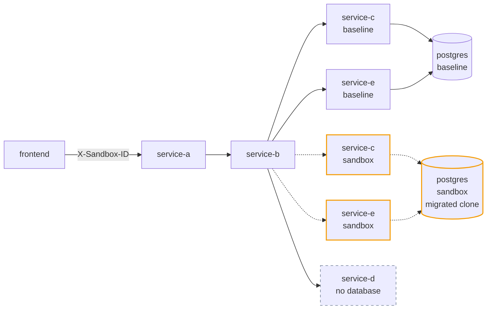
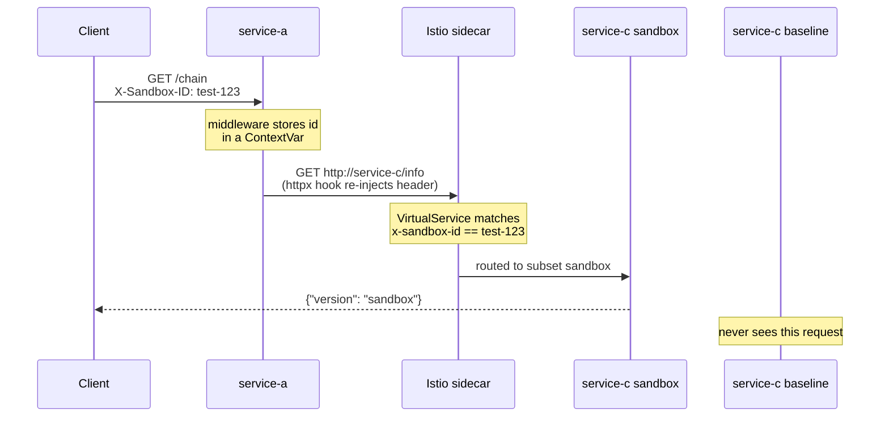
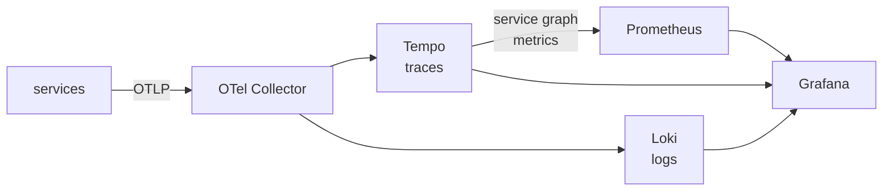

# Request-Scoped Sandboxes with Istio

One HTTP header routes a request to a modified version of a service. Everything else stays
shared. **No routing logic in application code** — Istio decides.



Solid lines are the default path. Dashed lines activate only when the header matches.

| `X-Sandbox-ID` | service-c | service-e | service-d |
| --- | --- | --- | --- |
| absent | baseline | baseline | baseline |
| `test-123` | **sandbox** | **sandbox** | baseline |
| anything else | baseline | baseline | baseline |

`service-d` receives the header and still answers baseline — the control that proves only
the services you *choose* to sandbox get replaced.

## The point

`service-e` has **no code change** for this sandbox. Both deployments run the identical
image; only `DATABASE_URL` differs. It needs a sandbox deployment purely because the
database it reads was migrated.

> **The sandbox boundary follows the data dependency graph, not the diff.**

Point the unmodified `service-e` at the migrated clone and it dies:

```
psycopg.errors.UndefinedColumn: column "name" does not exist
```

## How the header travels



Two halves, both in `sandbox_propagation.py`:

```python
class SandboxPropagationMiddleware(BaseHTTPMiddleware):        # INBOUND
    async def dispatch(self, request, call_next):
        token = current_sandbox_id.set(request.headers.get(SANDBOX_HEADER))
        try:
            return await call_next(request)
        finally:
            current_sandbox_id.reset(token)      # or ids leak between concurrent requests

async def inject_sandbox_header(request: httpx.Request) -> None:   # OUTBOUND
    if (sandbox_id := current_sandbox_id.get()) is not None:
        request.headers[SANDBOX_HEADER] = sandbox_id
```

A middleware alone only sees inbound traffic. The `ContextVar` carries the value to the
outbound client, so handlers just call `client.get(url)` with no headers argument.

## The database

```bash
./db/clone-and-migrate.sh
```

Seeds baseline, `pg_dump`s it into the sandbox instance, then migrates **the clone only**:

```
postgres-baseline   products(id, name, price_cents, stock)
postgres-sandbox    products(id, price_cents, stock, brand, model)   ← name dropped
```

Baseline is never migrated. Every service that reads the migrated clone needs a sandbox
deployment — changed or not.

## Quick start

Requires [Colima](https://github.com/abiosoft/colima), `kubectl`, `istioctl`.

```bash
# 1. dedicated local cluster
colima start sandbox-poc --kubernetes --cpu 4 --memory 8 --disk 30

# 2. istio
istioctl install --context colima-sandbox-poc --set profile=demo -y
kubectl --context colima-sandbox-poc label namespace default istio-injection=enabled

# 3. images (Colima's k3s uses its own Docker daemon)
export DOCKER_HOST="unix://${HOME}/.colima/sandbox-poc/docker.sock"
for s in a b c d e; do docker build -t "service-${s}:latest" "./service-${s}"; done
docker build -t frontend:latest ./frontend

# 4. deploy
kubectl --context colima-sandbox-poc apply \
  -f k8s/database/ -f k8s/deployments/ -f k8s/services/ -f k8s/istio/

# 5. databases
KUBECTL="kubectl --context colima-sandbox-poc" ./db/clone-and-migrate.sh

# 6. wait for 2/2 (app + sidecar), then forward
kubectl --context colima-sandbox-poc get pods -w
kubectl --context colima-sandbox-poc port-forward svc/service-a 8080:80
```

> Quote the tag as `"service-${s}:latest"`. Unquoted, zsh reads `$s:latest` as a history
> modifier and silently builds `service-aatest` → `ImagePullBackOff`.

Other clusters: minikube needs `eval $(minikube docker-env)` before building; kind needs
`kind load docker-image …` after. If `get nodes` reports `containerd://` rather than
`docker://`, import the images with `k3s ctr images import`.

## Try it

```bash
curl -s http://localhost:8080/chain | jq '.downstream.downstream | map_values(.version)'
# { "c": "baseline", "d": "baseline", "e": "baseline" }

curl -s -H "X-Sandbox-ID: test-123" http://localhost:8080/chain \
  | jq '.downstream.downstream | map_values(.version)'
# { "c": "sandbox", "d": "baseline", "e": "sandbox" }

curl -s -H "X-Sandbox-ID: nope" http://localhost:8080/chain \
  | jq '.downstream.downstream | map_values(.version)'
# { "c": "baseline", "d": "baseline", "e": "baseline" }
```

The third case is the one that matters: the header propagates end to end (check the logs)
but no route matches, so baseline wins. **The application behaves identically in all three.**

Watch which pod answered:

```bash
kubectl --context colima-sandbox-poc logs -l app=service-c,version=sandbox -c service-c -f
```

## Frontend

```bash
kubectl --context colima-sandbox-poc port-forward svc/frontend 5173:80
```

http://localhost:5173 — three buttons, one per scenario, showing which version answered.

## Observability

```bash
kubectl --context colima-sandbox-poc port-forward -n observability svc/grafana 3000:3000
```

http://localhost:3000/d/sandbox-routing (no login).



A single trace shows the whole mechanism:

```
service-a  v=baseline  ROOT   GET /chain   sandbox.id=test-123
service-b  v=baseline  child  GET /chain   sandbox.id=test-123
service-c  v=sandbox   child  GET /info    sandbox.id=test-123
service-d  v=baseline  child  GET /info    sandbox.id=test-123
```

Same header everywhere, different versions answering.

## Layout

```
service-a/  service-b/    propagate the header (middleware + httpx hook)
service-c/  service-e/    read the database; two deployments each
service-d/                control — no database, always baseline
frontend/                 React + nginx proxy to service-a
db/migrations/            001 baseline, 002 sandbox-only breaking migration
k8s/istio/                DestinationRule + VirtualService per sandboxed service
k8s/observability/        Tempo, Loki, Prometheus, OTel Collector, Grafana
```

## Gotchas worth knowing

| Symptom | Cause |
| --- | --- |
| Header never matches | `VirtualService` must use lowercase `x-sandbox-id` — HTTP/2 normalizes, Istio's match is case-sensitive |
| Routing ignored entirely | Service ports must be named `http`, or Istio treats traffic as plain TCP |
| `426 Upgrade Required` | nginx needs `proxy_http_version 1.1`; the sidecar rejects HTTP/1.0 |
| Frontend always shows baseline | nginx drops unknown headers — needs `proxy_set_header X-Sandbox-ID $http_x_sandbox_id` |
| No database spans in traces | `setup_telemetry()` must run **before** importing the psycopg module; instrumentation is monkey-patching |
| `ImagePullBackOff` | Unquoted `$s:latest` in zsh builds a mangled tag |

## Further reading

[`docs/FORWARD-COMPATIBILITY.md`](docs/FORWARD-COMPATIBILITY.md) — the harder problem this
POC exposes: a sandbox writing a **new enum value** an older service cannot read. No schema
migration, no loud failure, and a rollback does not undo it.

[`docs/PRODUCTION-SYSTEMS.md`](docs/PRODUCTION-SYSTEMS.md) — how Uber (SLATE), Lyft,
DoorDash and Signadot implement this same pattern, what they use instead of a custom header,
and their own statements on why none of them isolate shared state.

## Cleanup

```bash
colima delete sandbox-poc
```
