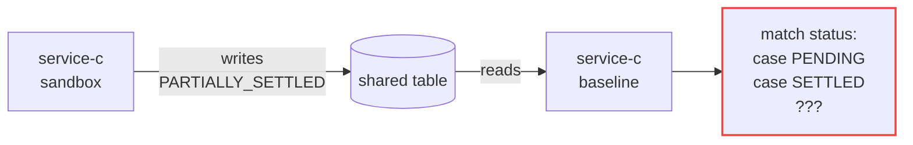
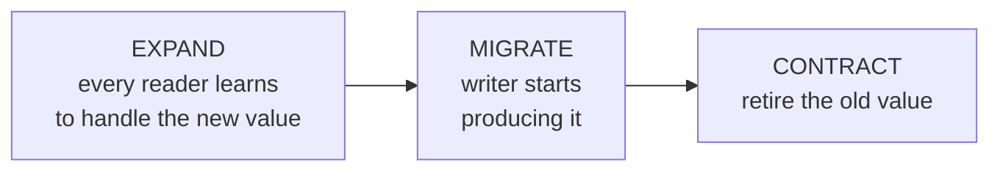

# The Enum Problem

Dropping a column fails loudly. This one does not.

> A sandbox writes a **new enum value** into a table an older service also reads. No schema
> migration is involved — the table is identical. Only the set of valid values changed.



## Why it is worse than a dropped column

| | `DROP COLUMN` | New enum value |
| --- | --- | --- |
| Detected by | Migration review | Nothing |
| Fails | Immediately, loudly | Silently, or much later |
| Error | `UndefinedColumn` | `KeyError`, `None`, or a wrong default |
| Rollback | Revert code, done | **Rows keep the unknown value forever** |

That last row is the real problem. Code reverts; data does not.

## This is not sandbox-specific

The same bug exists in any **rolling update** — during a rollout both versions run at once.
If v2 writes a value v1 cannot read, you have the bug with no sandbox, no migration and no
rollback involved.

A sandbox just makes the coexistence permanent instead of thirty seconds long.

## Why every safety net misses it

| Tool | Why it passes |
| --- | --- |
| Migrations | No schema change to review |
| Contract testing (Pact) | Verifies consumer-supplied *examples*; nobody wrote one for a value that did not exist |
| Integration tests | Run against one version at a time |
| Type checker | Each service compiles fine in isolation |

Pact's own team is explicit that schemas and contracts are different things — contract tests
assert observed examples, not the full space a schema permits
([pactflow.io](https://pactflow.io/blog/schemas-are-not-contracts/)).

## Three documented facts

**PostgreSQL enums are append-only.** There is no `ALTER TYPE ... DROP VALUE`
([docs](https://www.postgresql.org/docs/current/sql-altertype.html)). Adding one is not
rollback-safe either:

> *"it is unsafe to allow ALTER TYPE ADD VALUE in a transaction block, because instances of
> the value could be added to indexes later in the same transaction, and then they would
> still be accessible even if the transaction rolls back."*

**Protobuf's implicit `0` default causes silent corruption.** An old reader that discards an
unknown value falls back to whatever value `0` is — which may be a real, meaningful value.
Hence the convention to reserve `UNKNOWN = 0` as the first enum member
([protobuf.dev](https://protobuf.dev/programming-guides/enum/)).

**Protobuf and Avro chose opposite defaults.** Protobuf 3 enums are *open* — an unknown
value is preserved. Avro is *closed*: *"if the writer's symbol is not present in the
reader's enum and the reader has a default value, then that value is used, otherwise **an
error is signalled**"* ([Avro spec](https://avro.apache.org/docs/1.11.1/specification/)).
Anyone claiming schema systems handle this consistently is wrong.

## Defenses, cheapest first

### 1. Tolerant Reader

[Fowler, 2011](https://www.martinfowler.com/bliki/TolerantReader.html), descending from
Postel's Law (RFC 761): *"be conservative in what you do, be liberal in what you accept."*

Never write an exhaustive match over a value that comes from outside your process.

```python
# BREAKS on a new value
match status:
    case "PENDING": ...
    case "SETTLED": ...

# TOLERATES
KNOWN = {"PENDING", "SETTLED"}
if status not in KNOWN:
    logger.warning("unknown status=%s, skipping row id=%s", status, row_id)
    return SKIP        # an explicit decision, not an accidental fallthrough
```

The point is that **unknown is a first-class case with a log line**, not the `else` branch.

### 2. Open enum storage

| | Add a value | Remove a value | Rollback-safe |
| --- | --- | --- | --- |
| Native PG `ENUM` | `ALTER TYPE` | **impossible** | **no** |
| `CHECK` constraint | `ALTER TABLE` | yes | yes, transactional |
| Lookup table + FK | `INSERT` | yes, with metadata | yes |

A lookup table also lets you record *which version introduced each value* — turning an
implicit assumption into queryable data.

### 3. Parallel Change

[Fowler, 2014](https://www.martinfowler.com/bliki/ParallelChange.html), applied to values
rather than columns:



**A sandbox skips EXPAND by construction** — it writes a value no baseline reader knows.
That is precisely why it must write to a **cloned** database, as this POC does.

### 4. Write-side guardrail

The layer that converts a silent bug into a loud one:

```python
def assert_writable(column: str, value: str) -> None:
    if value not in baseline_known_values(column):
        raise ForwardCompatibilityError(
            f"{column}={value} is not readable by baseline. "
            f"Deploy readers first (expand), then write."
        )
```

DoorDash does the equivalent at the tenancy boundary, so *"test consumers cannot place
orders with real stores."*

## What this means for the sandbox design

If a sandbox introduces a value baseline cannot read, it has exactly two safe options:

1. **Clone the database** — what this POC does. Tractable when a handful of services share
   one database. For large datasets, copy-on-write branching
   ([Neon](https://neon.com/docs/introduction/branching)) keeps it cheap: *"giving ten
   engineers their own copy of a 50 GB database doesn't cost you 500 GB."*

2. **Deploy readers first** — the EXPAND step. Every consumer learns the value before
   anything writes it. Slower, but no clone needed.

There is no third option where you write freely into a shared table and hope.
