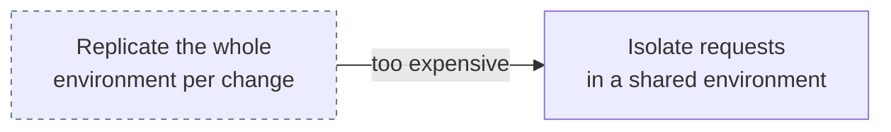

# How Production Systems Do This

The pattern in this POC is not invented. Uber, Lyft, DoorDash and Signadot all converged on
the same shape: **isolate requests inside a shared environment**, rather than replicating
environments.

## Context carrier and routing layer

| | Carrier | Routing layer | Scale |
| --- | --- | --- | --- |
| **Uber SLATE** | Jaeger baggage `request-tenancy` = `uber/test/slate/{ID}` | Edge-Gateway + host-routing-agent | ~4,500 services |
| **Lyft** | OpenTracing baggage in `x-ot-span-context` | Custom Envoy HTTP filter | 100+ services/month |
| **DoorDash** | Header → OTel baggage at the CDN, tenant `L0:L1` | OpenTelemetry + mesh | 100s of services |
| **Signadot** | `sd-routing-key` in OTel baggage | Istio, or their DevMesh sidecar | "hundreds" per cluster |
| **This POC** | Custom `X-Sandbox-ID` header | Istio `VirtualService` | 5 services |

The custom header here is a teaching choice — it makes propagation visible in
`sandbox_propagation.py`. Production systems use **tracing baggage** because it already
propagates. The [CNCF puts it plainly](https://www.cncf.io/blog/2024/05/28/is-testing-in-production-even-possible/):

> *"You can use a custom header… you have to modify the code of each service to pass the
> header."*

Which is exactly the module this POC had to write.

## They all abandoned full replication first

| Company | Abandoned | Stated reason |
| --- | --- | --- |
| DoorDash | Full staging replica | *"running all the microservices requires a lot of hardware resources"* |
| Lyft | "Onebox" | *"reached a point where it could not scale anymore"* |
| Slack | Long-lived shared instances | *"got gunked up over time and would stop behaving reliably"* |

## Nobody isolates shared state

This is the part usually left out of the diagrams. All four accept contamination and manage
it with tagging plus application guardrails:

- **Uber:** *"SUT uses production instances of dependencies by default, for guaranteeing the
  best fidelity while ensuring production safety."* Isolation is opt-in per service, and
  *"most share production datastores."*
- **Lyft:** *"It talks to standard databases."* No per-sandbox database isolation published.
- **Signadot:** *"Most teams start with the shared database model for convenience and use
  ephemeral databases only when necessary."*
- **DoorDash:** `tenant_id` columns via DBMesh, plus guardrails so *"test consumers cannot
  place orders with real stores."*

Uber is explicit about the tradeoff: *"The approach prioritizes production fidelity over
complete isolation for typical use cases."*

### Why this POC clones instead

Cloning the database is tractable at small fan-out. If four or five services share one
database, the blast radius is knowable and the clone is cheap.

At Uber's scale a single request crosses dozens of datastores, so the clone boundary
explodes across the dependency graph — which is why they tag instead. For large datasets,
copy-on-write branching brings cloning back into range:
[Neon](https://neon.com/docs/introduction/branching) creates a branch in under a second
regardless of size, because *"the branch and its parent share the same underlying storage,
and you only pay for the changes (deltas) the new branch writes."*

## Known limitations, in their own words

**Uber — async flows break routing:**

> *"Flows or requests which are triggered by asynchronous events… there is no direct
> injection of request-tenancy or routing-override keys in Jaeger baggage as it happens in
> synchronous requests. As a result, routing to SUT can break for such asynchronous
> requests."*

Also: only one version of a service can be deployed under SLATE at a time, and environments
default to a 2-day TTL.

**Signadot — resources may not be isolatable per request:**

> Database and queue resources *"may require extra isolation"* and *"it may not be feasible
> to isolate them at the request level."*

## Message queues are solved differently than databases

All three treat this as a separate engineering effort, and they picked different mechanisms:

| | Approach |
| --- | --- |
| **Uber** | Tenancy-aware Kafka client auto-routes messages to test vs prod clusters |
| **Signadot** | Sandboxed consumer joins a distinct consumer group, reusing Kafka's native fan-out |
| **DoorDash** | OTel agent tags messages with tenant info via native Kafka headers |

For brokers without native fan-out (SQS, RabbitMQ, Pub/Sub), Signadot documents SNS fan-out
to per-sandbox queues or consumer-side filtering — explicitly noted as adding overhead
rather than being a clean solution.

## Cache isolation is undocumented

No company or vendor source found — including Signadot's own docs, checked directly —
publishes a concrete cache-key namespacing strategy for sandboxes. If your architecture
shares a Redis, you are in territory nobody has mapped publicly.

## Different pattern: full clone per sandbox

Worth contrasting. Stripe and Slack went the opposite way:

- **Stripe sandboxes:** *"a separate copy of your Stripe account with its own test data and
  its own configuration"* — up to 5 per account.
- **Slack:** each dev environment is a fully isolated EC2 instance with its own subdomain;
  550 of them by 2019. *"No changes in dev environments can impact real users because they
  use their own set of infrastructure."*

Clean isolation guarantees, paid for in cost and complexity, and routed by account or
subdomain rather than by header.

## Sources

- [Uber — Simplifying Developer Testing Through SLATE](https://www.uber.com/en-IN/blog/simplifying-developer-testing-through-slate/)
- [Lyft — Extending our Envoy mesh with staging overrides](https://eng.lyft.com/scaling-productivity-on-microservices-at-lyft-part-3-extending-our-envoy-mesh-with-staging-fdaafafca82f)
- [DoorDash — Moving E2E testing into production with multi-tenancy](https://careersatdoordash.com/blog/moving-e2e-testing-into-production-with-multi-tenancy-for-increased-speed-and-reliability/)
- [Signadot — Sandbox concepts](https://www.signadot.com/docs/concepts/sandbox) and [data isolation guide](https://www.signadot.com/docs/guides/set-up-data-isolation)
- [CNCF — Is testing in production even possible?](https://www.cncf.io/blog/2024/05/28/is-testing-in-production-even-possible/)
- [W3C Baggage specification](https://www.w3.org/TR/baggage/)
- [Neon — Branching](https://neon.com/docs/introduction/branching)
- [Slack — Development environments at Slack](https://slack.engineering/development-environments-at-slack/)
- [Stripe — Sandboxes](https://docs.stripe.com/sandboxes)

Lyft's and DoorDash's engineering blogs return HTTP 403 to automated fetches; those quotes
come from search-indexed excerpts corroborated across independent queries, not raw page
reads. Uber, Signadot, CNCF, Neon, Slack and Stripe sources were fetched directly.
